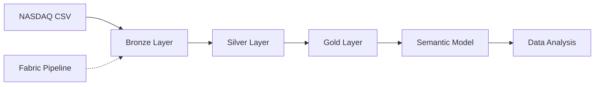
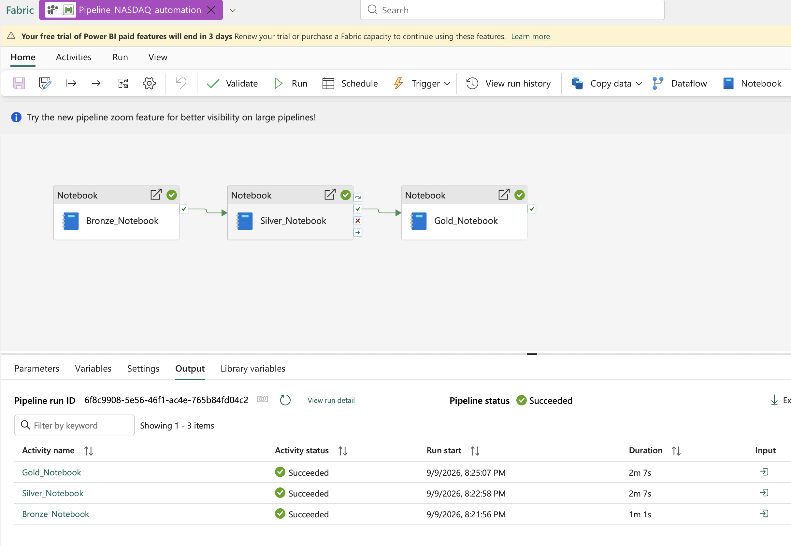

# Microsoft Fabric NASDAQ Lakehouse

An end-to-end data engineering project that transforms raw NASDAQ stock-market data into an analytics-ready data product using Microsoft Fabric, PySpark, Delta Lake, medallion architecture, pipeline orchestration, and semantic modeling.

## Project Overview

This project demonstrates how Microsoft Fabric can be used to build a layered Lakehouse solution:

- Ingest raw NASDAQ data from the Lakehouse Files area
- Apply an explicit schema and capture lineage metadata
- Clean, validate, deduplicate, and standardize stock data
- Incrementally load the Silver layer using Delta Lake `MERGE`
- Calculate analytical metrics using PySpark window functions
- Optimize Delta tables using `OPTIMIZE` and `ZORDER`
- Orchestrate notebooks with a Microsoft Fabric data pipeline
- Expose the Gold table through a semantic model for analysis

## Architecture



For detailed architecture and processing logic, see [Solution Architecture](docs/architecture.md).

## Pipeline Execution



The pipeline executes the notebooks sequentially:

```text
Bronze Notebook → Silver Notebook → Gold Notebook
```

Downstream activities run only after the preceding notebook completes successfully.

## Medallion Architecture

### Bronze Layer

The Bronze notebook:

- Reads the raw CSV from Microsoft Fabric Lakehouse Files
- Enforces an explicit PySpark schema
- Prevents schema inference and unexpected type drift
- Adds load timestamp and source-file metadata
- Writes the raw dataset as a managed Delta table

**Output table:** `bronze_nasdaq_stocks`

### Silver Layer

The Silver notebook:

- Reads from the Bronze Delta table
- Removes duplicate company-date records
- Trims and standardizes company values
- Converts dates and numeric fields into appropriate data types
- Filters records with invalid company, date, or closing-price values
- Performs an incremental Delta Lake `MERGE`
- Optimizes storage using Z-Ordering

**Output table:** `silver_nasdaq_stocks`

### Gold Layer

The Gold notebook uses PySpark window functions to calculate:

- Previous closing price
- Daily return percentage
- 30-day moving average of closing price
- 30-day moving average of trading volume

The resulting Delta table is optimized by company and date for analytical queries.

**Output table:** `gold_fact_nasdaq_trades`

## Semantic Model

A semantic model is created from the Gold-layer table to provide a governed, analytics-ready interface for downstream reporting and analysis.

The model exposes standardized stock-market fields and calculated financial metrics without requiring consumers to query the underlying Lakehouse tables directly.

## Repository Structure

```text
microsoft-fabric-nasdaq-lakehouse/
├── notebooks/
│   ├── 01_bronze_ingestion/
│   │   └── nasdaq_bronze_ingestion.ipynb
│   ├── 02_silver_transformation/
│   │   └── nasdaq_silver_transformation.ipynb
│   └── 03_gold_enrichment/
│       └── nasdaq_gold_enrichment.ipynb
├── docs/
│   ├── architecture.md
│   └── screenshots/
│       └── fabric_pipeline_success.png
├── .gitignore
├── LICENSE
└── README.md
```

## Technologies Used

- Microsoft Fabric
- Fabric Lakehouse
- OneLake
- Fabric Data Factory pipelines
- Apache Spark
- PySpark
- Delta Lake
- Spark SQL
- Semantic models
- GitHub

## Engineering Practices Demonstrated

- Medallion architecture
- Schema enforcement
- Data lineage metadata
- Data validation
- Deduplication
- Incremental upserts
- Delta Lake optimization
- Window-function calculations
- Dependency-based orchestration
- Exception handling
- Separation of storage, transformation, and consumption layers

## Running the Project

1. Upload the NASDAQ CSV file to:

   ```text
   Files/NASDAQ_raw/nasdaq100_latest_raw_data.csv
   ```

2. Attach the notebooks to the target Microsoft Fabric Lakehouse.
3. Configure the Fabric pipeline activities in this order:

   ```text
   Bronze Notebook → Silver Notebook → Gold Notebook
   ```

4. Run or schedule the pipeline.
5. Verify that these tables were created:

   ```text
   bronze_nasdaq_stocks
   silver_nasdaq_stocks
   gold_fact_nasdaq_trades
   ```

6. Create or refresh the semantic model using the Gold table.

## Future Enhancements

- Parameterize source paths and table names
- Add a quarantine table for rejected records
- Introduce automated data-quality checks
- Implement incremental Bronze ingestion
- Add pipeline alerts and operational monitoring
- Add unit tests for transformation rules
- Implement CI/CD using Microsoft Fabric Git integration

## License

This project is licensed under the MIT License.
