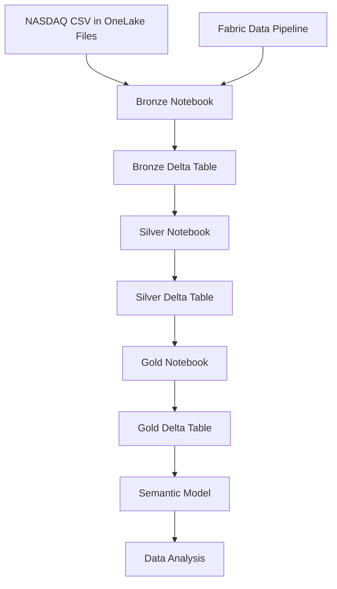

# Solution Architecture

This project implements a medallion architecture in Microsoft Fabric to transform raw NASDAQ stock-market data into an analytics-ready data product.

## Data Flow

1. Raw NASDAQ data is uploaded to the Microsoft Fabric Lakehouse Files area.
2. The Bronze notebook applies an explicit schema and writes the source data to a Delta table with lineage metadata.
3. The Silver notebook deduplicates records, standardizes data types, validates required fields, and performs a Delta `MERGE`.
4. The Gold notebook calculates previous closing price, daily return percentage, 30-day price moving average, and 30-day volume moving average.
5. The Fabric pipeline executes the Bronze, Silver, and Gold notebooks sequentially.
6. The Gold table supports a semantic model for downstream analytics.

## Pipeline Execution

